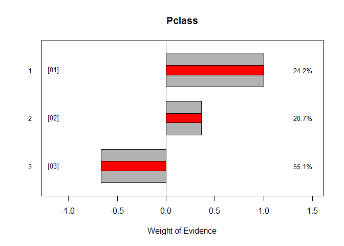

<!-- README.md is generated from README.Rmd. Please edit that file -->
What is Rubbish?
================

`rubbish` is an R package that helps modelers build scorecards. Scorecard models need to be more than predictive. Regulatory oversight often necessitates they be transparent as well. Model transparency is difficult to enforce in more predictive, non-linear methods such as neural networks, random forest, or gradient boosted decision trees. Often direct modeler intervention is required to ensure proper treatment is given for values of independent variables.

`rubbish` attempts to solve these problems by providing interactive variable manipulation facilities giving the modeler total control over how variables are treated in scorecard models.

Installing rubbish
------------------

The easiest way to install `rubbish` is by using the `devtools` package:

``` r
if (!require(devtools)) install.packages("devtools")
devtools::install_github(repo="Zelazny7/rubbish")
```

Overview of rubbish
-------------------

`rubbish` is comprised of three main modeling steps: Bin, Fit, & Adjust. Each of these steps are outlined in the following sections.

### Bin

The Bin phase prepares a data set of explanatory features for modeling by discretizing variables and wrapping in an object that provides data manipulation capabilities. How variables are treated by the binning step depends on their type. Numeric features such as age or income are discretized using a performance metric. For example, if the performance variable is binary, the numeric independent variables are discretized using information value.

If the variable is a categorical field (factors in R) no discretization can be performed; however, the features is still wrapped by a bin object and can be interacted with as such.

``` r
mod <- bin(data=titanic[,-1], y=titanic$Survived)
```

Calling the `bin` function returns a Scorecard object. The Scorecard object contains methods for manipulating and fitting the discretized variables, or "bins" in rubbish parlance. The Scorecard object maintains a list of bins as and keeps track of the operations requested by the modelers. It also contains a list of fitted scorecard models that can be adjusted or reviewed. These capabilities will be expanded upon in later sections.

``` r
> mod
#> 1 models
#>  |-- *  scratch              | 00.0 ks |
```

Bin variables can be accessed directly. Though as we'll see later, this is not recommended. But for illustration purposes, the following output is the kind of information a bin object typically stores:

``` r
> mod$variables$Pclass
#> Pclass
#>           N  #1  #0    %N    %1    %0  P(1)    WoE    IV   Pred
#> [01]  1 216 136  80 0.242 0.398 0.146 0.630  1.004 0.253  1.004
#> [02]  2 184  87  97 0.207 0.254 0.177 0.473  0.364 0.028  0.364
#> [03]  3 491 119 372 0.551 0.348 0.678 0.242 -0.666 0.220 -0.666
#>         891 342 549 1.000 1.000 1.000 0.000  0.000 0.501  0.000
```

Additionally, bin objects can be plotted by calling their `plot` method.

``` r
> mod$variables$Pclass$plot()
```



### Fit

The second step of scorecard developement using `rubbish` is fitting a model. `rubbish` uses the `glmnet` package under the hood to fit a regularized regression model. The discretized variables have their observed performance values substituted for their actual input values to create a completely continuous dataset.

> For example, if an age variable is discretized using binary performance the resulting substitution uses the observed weight-of-evidence rather than the age itself.

Performance substitution is used to put all predictors on the same scale and force a linear relationship between each predictor and the response variables.

``` r
mod$fit("model 1", "initial model with all variables")
```

``` r
> mod
#> 2 models
#>  |--    scratch              | 00.0 ks | 
#>  |-- *  model 1              | 61.6 ks | initial model with all variables
```

Once a model is fit, it can be predicted as well. This returns a score value appropriate for the type of model that was fit to the response variable. In the case of binary performance, a binomial response was selected resulting in a logit.

``` r
pred <- mod$predict()
```

``` r
> head(pred)
#>             [,1]
#> [1,] -2.17341549
#> [2,]  2.79122810
#> [3,] -0.08208419
#> [4,]  2.65690341
#> [5,] -2.06933532
#> [6,] -2.73979852
```

### Adjust

The most important functionality provided by `rubbish` is the manipulation of bin objects.

Bins can be collapsed:

``` r
mod$variables$Pclass$collapse(c(1,3))
mod$variables$Pclass$show()
#> Pclass
#>             N  #1  #0    %N    %1    %0  P(1)    WoE    IV   Pred
#> [01]  1,3 707 255 452 0.793 0.746 0.823 0.361 -0.099 0.008 -0.099
#> [02]  2   184  87  97 0.207 0.254 0.177 0.473  0.364 0.028  0.364
#>           891 342 549 1.000 1.000 1.000 0.000  0.000 0.036  0.000

# Alternate syntax
# mod$variables$Pclass - c(1,3)
```

Bins can be expanded:

``` r
mod$variables$Pclass$expand(1)
mod$variables$Pclass$show()
#> Pclass
#>           N  #1  #0    %N    %1    %0  P(1)    WoE    IV   Pred
#> [01]  1 216 136  80 0.242 0.398 0.146 0.630  1.004 0.253  1.004
#> [02]  2 184  87  97 0.207 0.254 0.177 0.473  0.364 0.028  0.364
#> [03]  3 491 119 372 0.551 0.348 0.678 0.242 -0.666 0.220 -0.666
#>         891 342 549 1.000 1.000 1.000 0.000  0.000 0.501  0.000

# Alternate syntax
# mod$variables$Pclass + 1
```
